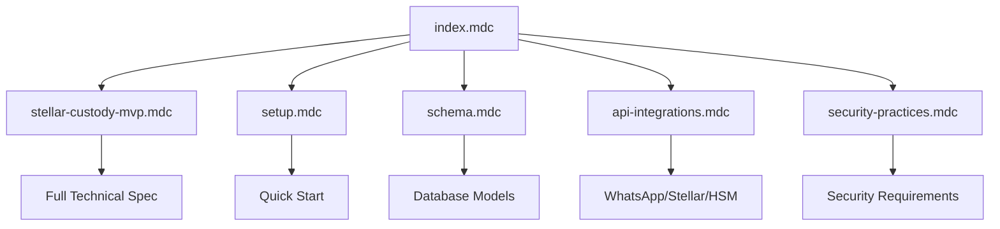

# 📚 Cursor Rules - Stellar Custody MVP

## Overview

This directory contains **Cursor AI rules** that provide comprehensive guidance for developing the Stellar Custody Multi-Sig MVP system. These rules ensure consistent, secure, and high-quality code generation.

## 🗂️ Rule Files

| File | Purpose | Auto-Applied | Description |
|------|---------|--------------|-------------|
| **[index.mdc](index.mdc)** | Master Index | ✅ Yes | Central hub connecting all rules |
| **[stellar-custody-mvp.mdc](stellar-custody-mvp.mdc)** | Main Specification | ✅ Yes | Complete technical spec and architecture |
| **[setup.mdc](setup.mdc)** | Quick Start Guide | ❌ No | Environment setup and commands |
| **[schema.mdc](schema.mdc)** | Database Schema | 🔧 Conditional | Prisma schema and models |
| **[api-integrations.mdc](api-integrations.mdc)** | API Guidelines | 🔧 Conditional | External service integrations |
| **[security-practices.mdc](security-practices.mdc)** | Security Standards | 🔧 Conditional | Security implementation rules |

## 🎯 How Rules Work Together



## 📋 Key Features Covered

### 1. **Multi-Signature System**
- 2-of-3 guardian approval requirement
- TOTP authentication per guardian
- WhatsApp notifications for approvals

### 2. **Security Architecture**
- HSM DINAMO for key management
- No private keys in code/database
- Comprehensive audit logging

### 3. **Technology Stack**
- Backend: NestJS + TypeScript
- Frontend: Next.js 15 + TailwindCSS
- Database: PostgreSQL + Prisma
- Blockchain: Stellar + Soroban

### 4. **External Integrations**
- WhatsApp: ZuckZapGo API
- Stellar: Testnet/Mainnet
- HSM: DINAMO hardware module

## 🚀 Quick Start for AI Agent

1. **First Time**: Read `index.mdc` for overview
2. **Architecture**: Check `stellar-custody-mvp.mdc`
3. **Security**: Always apply `security-practices.mdc`
4. **Database**: Use `schema.mdc` for models
5. **APIs**: Follow `api-integrations.mdc`

## 🔒 Critical Security Rules

1. **Keys**: ALL private keys must be in HSM
2. **Auth**: TOTP required for guardian actions
3. **Approval**: 2-of-3 guardians for high-value TX
4. **Audit**: Log every sensitive action
5. **Encrypt**: Sensitive data must be encrypted

## 📝 Development Workflow

```bash
# 1. Setup environment
Follow setup.mdc

# 2. Initialize project
Follow stellar-custody-mvp.mdc Phase 1

# 3. Implement features
Follow implementation checklist

# 4. Test security
Follow security-practices.mdc

# 5. Deploy
Follow production guidelines
```

## 🎨 Rule Metadata

### Always Applied Rules
```yaml
alwaysApply: true
# Applied to every file in project
```

### Conditional Rules
```yaml
globs: "*.prisma,**/models/**"
# Applied only to matching files
```

### Reference Rules
```yaml
description: "Quick start guide"
# Available when requested
```

## 📊 Coverage Matrix

| Feature | Spec | Schema | API | Security | Setup |
|---------|------|--------|-----|----------|-------|
| Guardian Registration | ✅ | ✅ | ✅ | ✅ | ✅ |
| Transaction Flow | ✅ | ✅ | ✅ | ✅ | ✅ |
| WhatsApp Integration | ✅ | ✅ | ✅ | ⚠️ | ✅ |
| HSM Operations | ✅ | ⚠️ | ✅ | ✅ | ⚠️ |
| Smart Contracts | ✅ | ❌ | ✅ | ⚠️ | ⚠️ |

Legend: ✅ Full Coverage | ⚠️ Partial | ❌ Not Applicable

## 🚨 Important Notes

1. **Security First**: When in doubt, choose the more secure option
2. **HSM Required**: System won't work without HSM configured
3. **Testnet Default**: Always use testnet unless explicitly for production
4. **WhatsApp Token**: Must be configured in environment
5. **Multi-Sig Logic**: Both off-chain and on-chain (Soroban)

## 🔄 Rule Updates

Rules are version controlled and should be updated when:
- New features are added
- Security requirements change
- APIs are updated
- Best practices evolve

---

**These rules ensure the AI agent builds a secure, robust, and production-ready Stellar Custody system!**
